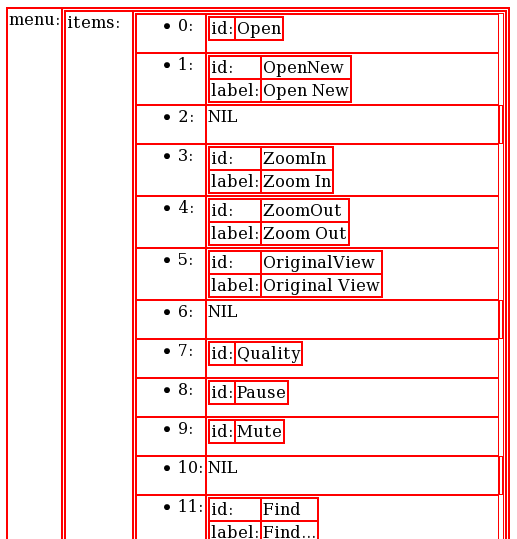

# JSON Renderer

If you ever need a quick glimpse of some JSON on an actual website, as an HTML table... this right here does just that.

`res/html/data.html` and `res/html/data.clean.html` give you an idea of how the output looks. Use CSS to customize at your own volition.

